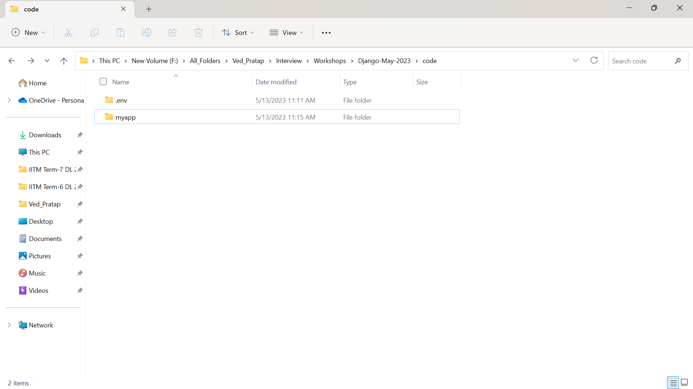
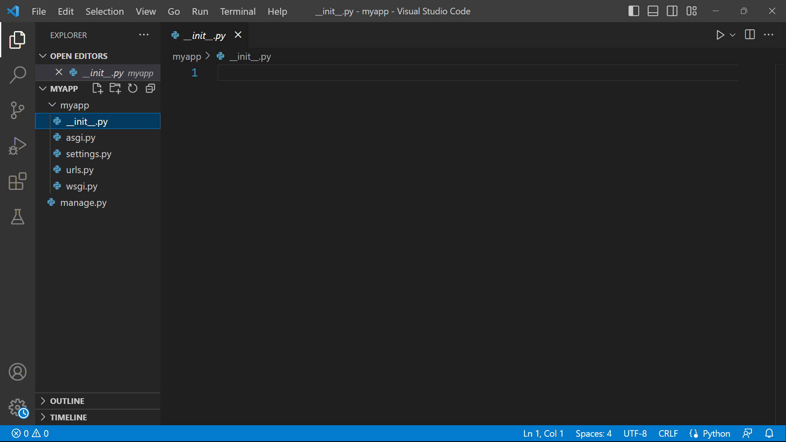

# Django-BootCamp-May-23
Web Application Using Python Django.

## Day 01/03 (Topics Covered)
- Django Installation & Setting up a new project
- Run Django Development server
- Setting Up Views & URLs
- Templates, Static Assets, Template Inheritance
- GET vs POST
- Additional - Table for a number using jinja template

### Django Installation & Setting up a new project
- Go to the desired directory where you want to setup your project.
- Open `Command Prompt` there or any command line environment.
- First create Virtual Environment and activate it in the same directory.
  - `python -m venv .env` : It will create `.env` folder.
  - `.env\scripts\activate` : It will activate virtual environment.
  - `Note` : Python virtual environments give you the ability to isolate your Python development projects from your system installed Python and other Python environments. This gives you full control of your project and makes it easily reproducible.
- Install Django : `pip install django` - This will install Django framework.
- Run the command `django-admin` for checking proper installment of django. It will run smoothly in case of proper installation.
- Run the command `django-admin startproject projectname` : This will create projects (some directories) inside the folder as shown below. `projectname` can be anything. Example shown below using `myapp`

- structure of folder

- Explanations
  - `manage.py`
    - If you are not new to Django, you must have seen the word “command-line utility” many times. But what does this mean?
    - Well, by using the command-line utility, you can migrate i.e., either import or export metadata objects across different domains or setup. You can create one or more       objects within an object or its multiple objects. Now straight away coming to the topic. What is `manage.py`?
    - This file is used as a command-line utility for our projects. We will use this file for debugging, deploying, and running our web applications.
    - The file contains the code for running the server, makemigrations or migrations, and several other commands as well, which we perform in the code editor.
    - It performs the same things as django-admin but also provides some project-specific functionality. 
  - `__init.py_`
    - This is an empty file. The function of this file is to tell the Python interpreter that this directory is a package and involvement of this `__init.py_` file in it  makes it a python project.
  - `settings.py`
    - It contains the Django project configuration.
    - The `setting.py` is the most important file, and it is used for adding all the applications and middleware applications. This is the main setting file of the Django  project. 
    - This contains several variable names, and if you change the value, your application will work accordingly.
    - It contains sqlite3 as the default database. We can change this database to Mysql, PostgreSQL, or MongoDB according to the web application we create.
    - It contains some pre-installed apps and middleware that are there to provide basic functionality.
  - `urls.py`
    - URL is a universal resource locator, it contains all the endpoints that we should have for our website. It is used to provide you the address of the resources (images, webpages, websites, etc) that are present out there on the internet.
    - In simpler words, this file tells Django that if a user comes with this URL, direct them to that particular website or image whatsoever it is.
  - `wsgi.py`
    - When you will complete your journey from development to production, the next task is hosting your application. Here you will not be using the Django web server, but the WSGI server will take care of it.
    - WSGI stands for Web Server Gateway Interface, it describes the way how servers interact with the applications.
    - It is a very easy task, you just have to import middleware according to the server you want to use. For every server, there is Django middleware available that solves all the integration and connectivity issues. 
  - `asgi.py`
    - ASGI works similar to WSGI but comes with some additional functionality.  ASGI stands for Asynchronous Server Gateway Interface. It is now replacing its predecessor WSGI. 

### Run Django Development server
- Open the `command prompt` inside the main project folder where the file `manage.py` is present.
- Run the command `python manage.py runserver` : It will start the development server or we can say that it will run our web application.
- It will host our application on url ` http://127.0.0.1:8000/`. we can copy and paste it in our browser.
- By default landing page will be as shown below.
- By default there is one url defined in `urls.py` file for admin login. we can go to `http://127.0.0.1:8000/admin` for admin login page as shown below.

### Setting Up Views & URLs
- We will create or define our all endpoints in file `urls.py`. By default there is only one `\admin`.
- The structure for defining the endpoints are as below:
  - `path('url', function(), name = '')`
  - Example : `path('\home', Home.as_view(), name='home')` 
  - Empty path `' '` means homepage. 
- Since all the urls will work on the function, we will create a new file `view_function.py` (name is optional) which will contain all the function required for all the urls in our project as shown below.

### Templates, Static Assets, Template Inheritance
- We can render text, raw_html, HTML Files, images or anything to our web pages.
  - #### Text or Raw_html
    - write this `from django.http import HttpResponse` in `view_function.py` file. 
    - create function in `view_function.py` file which will return text or raw_html.
    - import all the function from `view_function.py` to `urls.py` by writing `from . import view_function` in `urls.py`.
    - create url in `url.py`. While creating urls, we will write function name as `view_function.functionname`.
    - Go to respective urls for seeing the contents.

   - Types of `import` in python.
    - **Quick Recap on Import**
      - You need to have a good understanding of Python modules and packages to know how imports work. A Python module is a file that has a .py extension, and a Python package is any folder that has modules inside it (or, in Python 2, a folder that contains an `__init__.py` file).
      - What happens when you have code in one module that needs to access code in another module or package? You import it! 
    - **How Imports Work**
      - The first thing Python will do is look up the name abc in `sys.modules`. This is a cache of all modules that have been previously imported.
      - If the name isn’t found in the module cache, Python will proceed to search through a list of built-in modules. These are modules that come pre-installed with Python and can be found in the Python Standard Library. If the name still isn’t found in the built-in modules, Python then searches for it in a list of directories defined by `sys.path`. This list usually includes the current directory, which is searched first.
      - When Python finds the module, it binds it to a name in the local scope. This means that abc is now defined and can be used in the current file without throwing a NameError.
      - If the name is never found, you’ll get a `ModuleNotFoundError`.
     - **Absolute Imports**
      - An absolute import specifies the resource to be imported using its full path from the project’s root folder.
      - *Examples:*
        -   `from package1 import module1`
        -   `from package1.module2 import function1`
        -   `from package2 import class1`
        -   `from package2.subpackage1.module5 import function2`
       - **Pros and Cons of Absolute Imports**
         - Absolute imports are preferred because they are quite clear and straightforward. It is easy to tell exactly where the imported resource is, just by looking at the statement. Additionally, absolute imports remain valid even if the current location of the import statement changes. In fact, PEP 8 explicitly recommends absolute imports.
         - Sometimes, however, absolute imports can get quite verbose, depending on the complexity of the directory structure. Imagine having a statement like this:
         - `from package1.subpackage2.subpackage3.subpackage4.module5 import function6`
         - That’s ridiculous, right? Luckily, relative imports are a good alternative in such cases!
     - **Relative Imports** - A relative import specifies the resource to be imported relative to the current location—that is, the location where the import statement is. There are two types of relative imports: implicit and explicit. Implicit relative imports have been deprecated in Python 3.
        - **Syntax and Practical Examples** 
        - The syntax of a relative import depends on the current location as well as the location of the module, package, or object to be imported. Here are a few examples of relative imports:
        - `from .some_module import some_class`
        - `from ..some_package import some_function`
        - `from . import some_class`
        - You can see that there is at least one dot in each import statement above. Relative imports make use of dot notation to specify location.
        - A single dot means that the module or package referenced is in the same directory as the current location. Two dots mean that it is in the parent directory of the current location—that is, the directory above. Three dots mean that it is in the grandparent directory, and so on. This will probably be familiar to you if you use a Unix-like operating system!
       - **Pros and Cons of Relative Imports**
       - One clear advantage of relative imports is that they are quite succinct. Depending on the current location, they can turn the ridiculously long import statement you saw earlier to something as simple as this:
       - `from ..subpackage4.module5 import function6`
       - Unfortunately, relative imports can be messy, particularly for shared projects where directory structure is likely to change. Relative imports are also not as readable as absolute ones, and it’s not easy to tell the location of the imported resources.

  - #### How to render HTML Files
    - Create folder `templates` with parallel to folder `myapp` and file `manage.py`.
    - All Html Files will reside under this folder.
    - Go to `settings.py` - TEMPLATES - DIRS - Write `DIRS = ['templates']`.
    - write this in `view_function.py` : `from django.shortcuts import render`.
    - create function for rendering html files. Template for that is as below:
    ```
    def function_name(request):
        return render(request, "filename.html", dictionary)
    ```
    - **Example :**
    ```
    def home(request):
        return render(request, "index.html", {"first" :"10", "second":20})
    ```
    - `return` statement has three parts: 1. we have to write `request`. 2. Write html file name within inverted commas. 3. Dictionary by which we can pass metadata to html file as a content. Example, we will send something as variable and use jinja templatation.
    - create url in `urls.py`. Go to that url.
  
  - #### How to render static files
    -  Create folder `static` with parallel to folder `templates`.
    -  Go to `settings.py`. There is something written as `STATIC_URL = 'static/'` which is url of our folder `static`.
    -  But below this line we have to specify directory under which static folder is present.
    -  Overall two lines will be :
    ```
    STATIC_URL = '/static/'
    STATICFILES_DIRS = ['BASE_DIR/static/']
    ```
    -  Now put anything inside the static folder. Example : images etc.
    -  We can access static folder files in out html as below:
    ```
     - For loading static folder.
     - url for the file.
    ```
    - We can use the above url as link in html under `<a><\a>` tag.
  - #### Template Inheritance
    - Template inheritance allows you to build a base “skeleton” template that contains all the common elements of your site and defines blocks that child templates can override.
    - Sounds complicated but is very basic. It’s easiest to understand it by starting with an example. 
    - **Base Template**
    - This template, which we’ll call `base.html`, defines a simple HTML skeleton document that you might use for a simple two-column page. It’s the job of “child” templates to fill the empty blocks with content:
    ```
    <!doctype html>
    <html>
      <head>
      
          <link rel="stylesheet" href="{{ url_for('static', filename='style.css') }}">
          <title> - My Webpage</title>
      
      </head>
      <body>
      <div id="content"></div>
      <div id="footer">
         
              &copy; Copyright 2010 by <a href="http://domain.invalid/">you</a>.
         
      </div>
      </body>
     </html>
    ```
    - In this example, the `` tags define four blocks that child templates can fill in. All the block tag does is tell the template engine that a child template may override those portions of the template.
    - **Child Template**
    - A child template might look like this:
    ```
      
      Index
      
         {{ super() }}
         <style type="text/css">
         .important { color: #336699; }
         </style>
      
      
         <h1>Index</h1>
         <p class="important">
         Welcome on my awesome homepage.
       
    ```
    - The `` tag is the key here. It tells the template engine that this template **“extends”** another template. When the template system evaluates this template, first it locates the parent. **The extends tag must be the first tag in the template**. To render the contents of a block defined in the parent template, use `{{ super() }}`.

### GET vs POST
- `Django's` form is returned using the **POST** method, in which the browser bundles up the form data, encodes it for transmission, sends it to the server, and then receives back its response. **GET** , by contrast, bundles the submitted data into a string, and uses this to compose a URL.
- If we are using any HTML Form, we should use `action = "url"` where url must not have slash(/). In case of django url replaces path_url which is defined in `urls.py`.
- By default method for any HTML Form is **GET**. We can specify `method = "post"` for using **POST** method in `<form method = "post"><\form>` tag.
- **Demonstrating GET Method**
  - create a form in index.html file with GET method.
  ```
     <form action="generate">
        <div class="mb-3">
            <label for="Number" class="form-label">Enter Number</label>
            <input type="number" name = "number" class="form-control" id="number" placeholder="0">
          </div>
          <div class="mb-3">
            <label for="upto" class="form-label">Upto</label>
            <input type = "number" class="form-control" name = "upto" id="upto" placeholder="0">
          </div>
          <input type = "submit">
     </form>
  ```
  - Create a new html file `showindex.html`.
  ```
    <!DOCTYPE html>
    <html lang="en">
    <head>
        <meta charset="UTF-8">
        <meta http-equiv="X-UA-Compatible" content="IE=edge">
        <meta name="viewport" content="width=device-width, initial-scale=1.0">
        <link href="https://cdn.jsdelivr.net/npm/bootstrap@5.3.0-alpha3/dist/css/bootstrap.min.css" rel="stylesheet" integrity="sha384-KK94CHFLLe+nY2dmCWGMq91rCGa5gtU4mk92HdvYe+M/SXH301p5ILy+dN9+nJOZ" crossorigin="anonymous">
        <script src="https://cdn.jsdelivr.net/npm/bootstrap@5.3.0-alpha3/dist/js/bootstrap.bundle.min.js" integrity="sha384-ENjdO4Dr2bkBIFxQpeoTz1HIcje39Wm4jDKdf19U8gI4ddQ3GYNS7NTKfAdVQSZe" crossorigin="anonymous"></script>
        <title>Show Index</title>
    </head>
    <body>
       <h2>Table for number {{number}} upto {{upto}}.</h2>
    </body>
    </html>
  ```
  - create a function `generate`.
  ```
      def generate(request):
        number = request.GET.get("number")
        upto = request.GET.get("upto")
        return render(request, "showindex.html", {"number":number, "upto":upto})
  ```
  - create url as : ` path('generate/', view_function.generate)`
  - It will show : **Table for number 7 upto 7.**
- Similary we can use `request.POST.get("number")` Which will demonstrate in next topic.
### Additional - Table for a number using jinja template
- In jinja, There is no `range(n)` function as python.
- **Solution**
- write the below statement in `view_function.py`
```
    from django.template.defaulttags import register
```
- create range function as below:
```
    @register.filter
    def get_range(value):
        return range(1, int(value)+1)
```
- Now we can use for loop and do calculation.
- In case of **POST** method, url will be with slash at end also eg. `127.0.0.1:8000/generate/`. For making this off set `APPEND_SLASH = False` in `settings.py`.
- And, define the url in `urls.py` without slash.
- Apart from that **POST** method need `csrf_token`. We can get rid of this by using `from django.views.decorators.csrf import csrf_exempt` in `view_function.py`. After that before defining any **POST** method function write `@csrt_exempt`
- For doing multiplication, we will also use filters as below:
```
    @register.filter
    def mul(a,b):
        return int(a)*int(b)

```
- In Html file we will use this filter as:
```
    {{ number | mul:i }}
```

## Day 02/03 (Topics Covered)
- Need of Models and defining models
- Database Connectivity
- Database Operations using Shell
- Start with frontend for blog app
- URL - View Mapping for existing code
